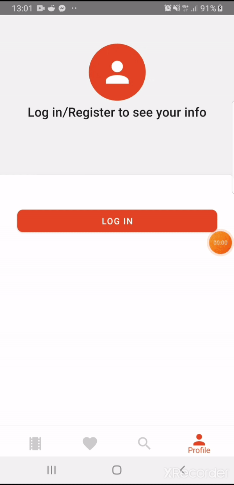

# NOT A FINAL VERSION

# ReflixApp

A basic application for browsing/searching/saving movies and saving them to your personal library.

### Key functionality

* Authentication using Firebase.
* Preview of three movie lists sorted by different categories.
* Detailed preview of a single movie and a related movies tab for the selected movie.
* Preview of the trailer of the selected movie.
* A library where the user can add any selected movie.
* Movie removal from the library.
* Movie search by Category/Title/Date/Description

# Main Technologies Used:

- App - React Native
- Server side - Node.js/Express.js
- Scraping data - Puppeter library
- Database - MongoDB/Mongoose

## Installation & Running

1. The app
    1. cd ReflixApp && npm install
    2. npm run android (app is optimized for Android)
2. Server side
    1. cd server && npm install
    2. npm run server

## Meta

Domantas Mikelionis - https://github.com/DomantasMk / https://www.linkedin.com/in/domantas-mikelionis-36aa84172/  
